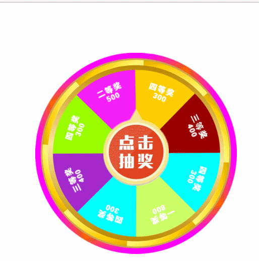

# 抽奖转盘

## 效果


## 代码实现方式
在原型链上编程，将旋转转盘用到的属性和方法都写到一个立即执行函数中。</br>
将Lottery类放到了window对象上，在这个立即执行函数中产生了闭包，只留给了外部一个接口不占用变量名。
```javascript
(function (win, $) {
    var defaultPar = {
    }
    win.Lottery = Lottery;  //挂到全局对象，形成闭包
    function Lottery(pars) {
    }
    Lottery.prototype.init = function () {
    }
})(window, $)
```
## 执行flag
在这种需要执行一段时间的事件中需要一个是否在执行的flag来保证同一时间只有一个想要的事件正在执行
