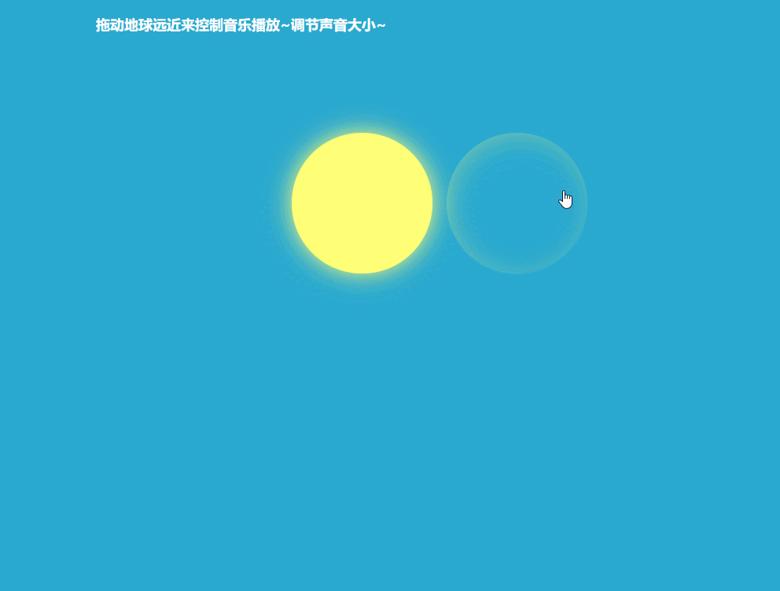

# 日食音量调节

## 效果


## 思路
拖拽（bindEvent） ->  计算覆盖百分比  ->音量改变 & 颜色改变
## 颜色单位 hsl
##### H： 
Hue(色调)。0(或360)表示红色，120表示绿色，240表示蓝色，也可取其他数值来指定颜色。取值为：0 - 360
##### S：
Saturation(饱和度)。取值为：0.0% - 100.0%
##### L：
Lightness(亮度)。取值为：0.0% - 100.0%
## 宽度是百分比，高度随着高度自适应变化 -> 固定宽高比
```css
{
    width: 20%;
    padding-top: 20%;
}
/* 基于父级宽度的设置  pdding-top和margin-top*/
```
## box-shadow

> box-shadow: h-shadow v-shadow blur spread color inset;

|值	|描述|	测试|
| - | - | - |
|h-shadow	|必需。|水平阴影的位置。允许负值。|	
|v-shadow	|必需。|垂直阴影的位置。允许负值。|	
|blur	|可选。|模糊距离。|	测试
|spread	|可选。|阴影的尺寸。|	测试
|color	|可选。|阴影的颜色。请参阅 CSS 颜色值。|	
|inset	|可选。|将外部阴影 (outset) 改为内部阴影。|	


## 拖拽的实现
```javascript
//拖动是3个事件
//鼠标按下
moon.on('mousedown', function(e){
    pos = e.clientX - moon.offset().left;
    flag = true;
});
//鼠标滑动
/*因为在body上移动，如果加在其他地方可能更不上就掉了*/
$('body').on('mousemove', function(e){
    if(flag){
        moon.css({
            'left': e.clientX - pos - $('.wrapper').offset().left
        })
    }
});
//鼠标抬起
$('body').on('mouseup', function(e){
    flag = false;
});
```
## 保留两位小数
 * +number.toFixed(2)
 * [number.toPrecision()](http://www.runoob.com/jsref/jsref-toprecision.html)  【使用不同进制把数字格式化为指定的长度】