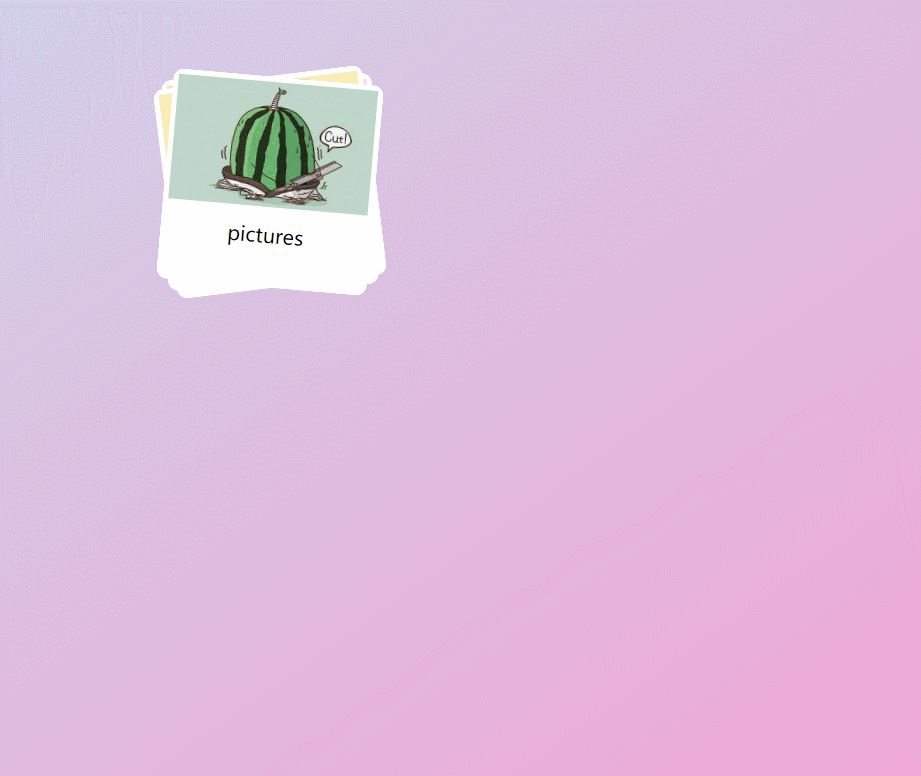

# 炫酷照片折叠特效
CSS实现动画

## 效果

## 渐变色
[使用CSS渐变 - Web开发者指南 | MDN](https://developer.mozilla.org/zh-CN/docs/Web/Guide/CSS/Using_CSS_gradients)

## 贝塞尔曲线
[参考网址](http://cubic-bezier.com/#.53,.22,.81,1.19)

## 动画延迟
transition-delay 
延迟时间等于之前动画的执行时间，看起来就是连贯的一串动画