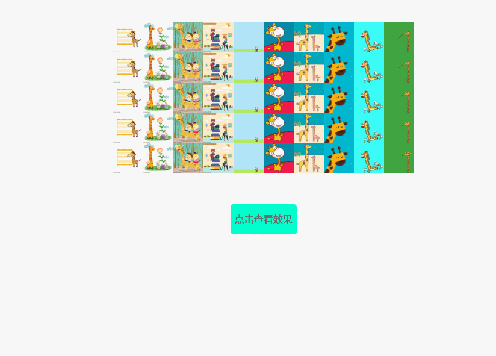

# 照片墙特效

## 效果展示


## 思路
图片： 变小 -> 变大 & 变透明 -> 旋转360deg</br>


## 以中心点为坐标缩小/放大
使用scale()缩放

## 动画事件管理
```javascript
/*
 * 动画执行管理函数
 * @param {*} dom 执行的元素
 * @param {*} time 执行动画时间
 * @param {*} doFun 执行什么动画
 * @param {*} callBack 执行完的回掉
 */
monition = function (dom, time, doFun, callBack) {
    var self = this;
    $(dom).css({
        'transition': time
    })
    doFun.call(dom);
    var called = false; //是否执行
    $(dom).on('transitionend', function () {
        if (!called) {
            callBack && callBack.call(dom);
            called = true;
        }
    })
}
```

## transition translate transform 的区别

## 随机让块内的dom开始执行动画
```javascript
setTimeout(function(){
    //执行函数
    //注意:
    //1. 这里面的this指向window
    //2. 这里的变量是拿到的上下文中的引用，如果有for循环的话需要使用立即执行函数将变量 i 传进来

}, Math.random()*1000);
```
